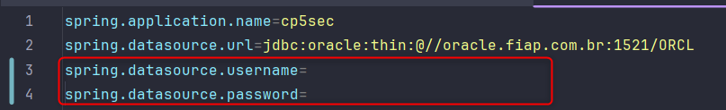
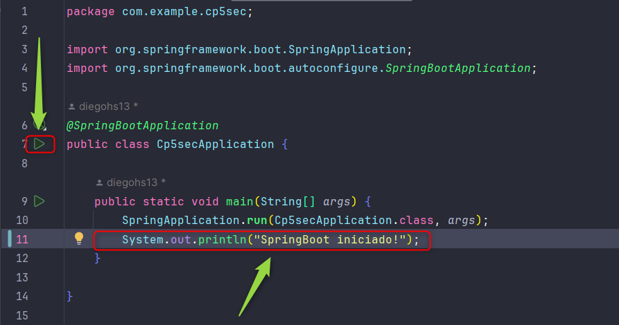

# Easy Toy
## Descrição

Projeto de desenvolvimento com Spring Boot Security para gerenciamento de um sistema de CRUD de brinquedos da loja Easy Toy.

## Integrantes

- MATHEUS MATOS - RM:99792
- KAREN VITORIA JESUS DA SILVA - RM:99468
- JULIANNY ARAUJO PEREIRA - RM:99554
- DIEGO HENRIQUE SANTOS DE OLIVEIRA - RM:550269
- JULIA DE FATIMA QUEIROZ - RM:551130

## Instruções para uso
O usuario pode cadastrar um brinquedo no sistema, inserindo os seguintes dados:
- Nome do Brinquedo
- Preço
- Classificação
- Descrição

## Endpoints

## Modelo de Dados

**TB_CP5_BRINQUEDO**
- id (chave primária)
- nome_brinquedo
- preco
- classificacao
- descricao 

## How to use
- Configuração do spring initializer.
  

- Configure o arquivo `application.properties` com as configurações do seu banco de dados.
  

- Execute a classe `Cp5secApplication.java` para iniciar a aplicação.
  

- Acesse o endereço `http://localhost:8080/` para acessar a aplicação.

## Nome da Aplicação
Easy Toy